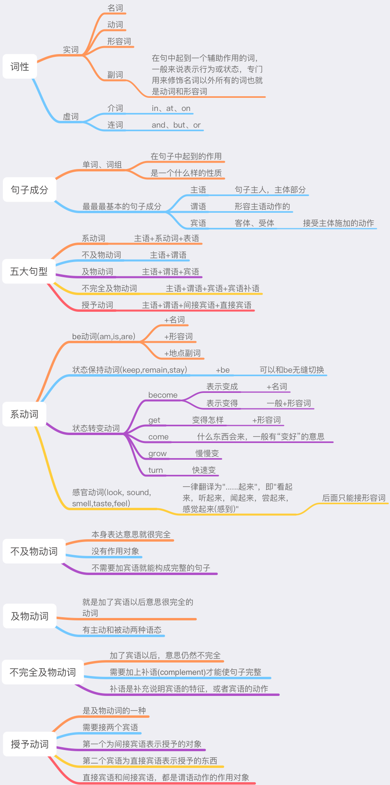

## 第一部分，如何用英语造出正确的简单句子

## 第1课：英文简单句的造句法则和基础语法概念

## 重点 掌握五大句型基本概念 完成口译笔译简单句

## 要想真正掌握英语，需要什么样的能力？

* 做到任何一句中国话，都能用英语表达出来！

## 不管句子多么复杂，其主干都只有5种

英语里边只有五种类型的动词，自然，就产生了5种句型

在正式开始学习语法之前要做的第一件事情就是，要弄清楚句子的主干，也就是五大句型

## 01 一些基础的语法概念：词性，一个单词的分类

词性，它指的是一个单词的分类，英语中所有的单词，基本都可以被分为两类：虚词和实词，分别是没有具体含义和有具体含义的词

虚词一般来说就是两类：

* 介词：in at on
* 连词：and but or

实词主要是有四大类

* 名词    用来表达一件东西的名称的词(花草、太阳、月亮...)
* 动词    表示运动的词(打、骂、唱、跳...)
* 形容词  专门用来修饰名词的词(美丽的女孩，高、帅、富)
* 副词    在句子里，起到一个辅助作用的词，一般来说它表示行为或者状态，专门用来修饰**名词以外所有的词**也就是**动词**和**形容词**(大声的唱歌)

注意：

英语的词类比较复杂，一般传统意义上的语法书，都是详细解释八大词类或者十六大词类，让人稀里糊涂头都晕了，真正的重要精华没学到，今天我们只普及一下最基础的概念，不多做深入，以后再慢慢讲解表达英文意思的最小单元，一般来说不是单词，而是短语和词组，比如说不定式短语大家都懂，那么不定式短语的词性属于什么？一般就很少有人知道了

## 01 一些基础的语法概念：句子成分

句子成分和词性是不一样的，单词组成了一个句子，那么这个单词或者词组，它在这个句子中起到一个什么样的作用，它是一个什么样的性质，这个叫做句子成分

主谓宾(主语、谓语、宾语)----最最最基本的句子成分

* 主语：指的就是这个句子的主人 主体部分
* 谓语：形容主语的动作的
* 宾语：宾语就是这个句子的宾客 客人，还有另一个说法叫做客体或者受体，它在句子里面处于接受的这个地位，接受主人所施加的动作

注意：主谓宾这类词，指的是句子成分，句子成分的称呼。单独的词性的称呼，是不一样的，比如说名词可以做主语和宾语，但是做主语和宾语的不一定只是一个名词，也可能是短语，或者短句

## 02 英语句子的本质和灵魂 五大动词---五大句型

五大动词五大句型
1. 系动词->主语+系动词+表语
2. 不及物动词->主语+谓语
3. 及物动词->主语+谓语+宾语
4. 不完全及物动词->主语+谓语+宾语+宾语补语
5. 授予动词->主语+谓语+间接宾语+直接宾语

## 01 系动词---主系表句型

所谓的系动词，也属于动词的一种

* 在句子里作谓语，没有实际的意思
* 比如汉语的“是”、“为”，英语里的 am、is、are
* 就是联系，在句子中起一个联系作用，叫做系动词

而在联系动词(linking verb)之后的补充说明主语性质的部分，就叫做表语

## 如何判断主系表结构，其实很简单

用中文判断这个句子里的谓语，可否用“是”，或者“为”来翻译

    I am(是) a good person
    I become(成为) a good person

## 系动词一共分成了4大类

1. be动词
2. 状态保持动词
3. 状态转变类动词
4. 感官动词

### be动词

am is are 和它们所对应的过去将来时态，was、were、will be等

在be动词之后，有3大类表语

* 名词 --- 名词做表语，这种句子和汉语可以完全对应，be动词翻译成汉语是“是”字

    Tim is an engineer. 蒂姆是个工程师

    The price is $2000! 价格是2000美元

* 形容词 --- 和汉语略有不同，be动词一般不翻译出来直接被省略。介词短语也可以相当于形容词

    The play was very interesting. 戏很有意思

    The milk is in the refrigerator. 牛奶在冰箱里，这里的in the refrigerator是介词短语可以做形容词

* 地点副词 --- 一定只能是地点副词，地点，地点，地点！！！别的副词是不行的

    Your sister is here these days. 你姐姐这段在这儿

    My bedroom is downstairs.   我的卧室在楼下

### 状态保持动词(keep, remain, stay)

这三个词后面只能加形容词作表语，可以和be无缝切换

You should **keep** quiet！  你应该保持安静！ 也可以 You should **be** quiet！

No one can **remain** youthful forever.     没有人能永葆青春

The weather **stayed** fine for a week.     这个星期天气一直很好

### 状态转变动词(become, get, go, come, grow, turn)

* become是一个万能词，既可以表示“变成“，这时候后面只能接名词
* 同时也可以表示”变得“，后面一般形容词

    He became a teacher.    他成为了一名教师

    He became very nervous. 他变得很紧张

* get表示“变得怎样”，后面只能加形容词

    He got very angry.  他非常生气

* come这个词的本意是来，什么东西会来，当然是好的东西，所以一般come含有“变好“的意思

    Thing will come right.  事情会变好

* go这个词的意思是走，去，你希望什么东西离你而去？当然是坏的东西，所以如果想要表达“变坏”，可以用go

    The meat always goes bad in summer.     肉在夏天经常会坏掉

* 如果你要表达“慢慢变”，可以用grow。因为grow的本意是“生长”，我们都是慢慢长大的

    The weather grew cold in the night.     晚上天气慢慢变冷

* 要表达“快速变”，应该用turn。因为turn本意是“转身”，当然是一下子转过去

    His face turned pale.   他脸色变得苍白

### 感官动词(look, sound, smell, taste, feel)

上述5个动词，一律翻译为"......起来"，即"看起来，听起来，闻起来，尝起来，感觉起来(感到)",后面只能接形容词(或相当于形容词的分词)作表语。

I **felt** very nervous when I went into his office.    我走进他的办公室，感到非常紧张

He **looked** very angry.   他看上去非常气愤

They were all hungry and the food **smelled** good.     他们全都饿了，饭菜散发出阵阵香味

感官动词后，绝不能直接加名词作表语，如要加名词，必须用：感官动词+介词like+名词，此时翻译为"像......"

The sun **looks like** an orange globe.     太阳看上去像只橙色的球体

## 02 不及物动词->主语+谓语

什么是不及物动词？

不及物动词intransitive verb，简称vi. 这种动词后面它不加任何物体，它本身表达的意思就很完全，没有作用对象，不需要加宾语就能构成完整的句子，例如：游泳，出生，笑，做梦...... 

判断这类动词，有个方法很简单，**把这个动词前面加上“被”字，看正常不正常。如果正常，就是及物动词，不正常，就是不及物动词。例如：被打，被处罚，被喜欢...... 但如果说：被跳舞，被做梦，被游泳......,肯定自己会觉得不通顺

### 句型注意事项

1. 这个句型，一般来说都带有状语，来进一步说明这个动作发生的时间，地点，目的......

    Detectives[主语] were waiting[谓语] at the airport[地点状语] all morning[时间状语].

    They[主语] were talking[谓语] loudly[方式状语].

    表示时间 地点和方式的句子成分 就叫做状语

2. 很多动词，本身就既可以作为不及物动词，也可以作及物动词，除了上述的判断方法外，得在具体语境中判断

## 03 及物动词->主语+谓语+宾语

 什么是及物动词呢？

 及物动词 transitive verb,简称vt.

 就是加了宾语以后意思很完全的动词，有主动和被动两种语态

 有些短语相当于及物动词，称为**及物动词短语**

Yesterday[时间状语], a pigeon[主语] carried[谓语] the first[定语] message[宾语] from Pinhurst to Silbury[地点状语].

昨天，一只鸽子把第一封信从平赫特带到锡尔伯里。

The bird[主语] coverred[谓语] the distance[宾语] in three minutes[时间状语].
    
这只鸟只用了3分钟就飞完了全程。

## 04 不完全及物动词->主语+谓语+宾语+宾语补语

什么是不完全及物动词？

不完全及物动词 incomplete transitive verb,简称i.vt

这种动词加了宾语以后，意思仍然不完全，需要加上补语(complement)才能使句子完整

补语是补充说明宾语的特征，或者宾语的动作。

* “她 使 我 爱上生活”

    这个“使”就是不完全及物动词，如果只说“她使我”意思当然不完整，得加上补语“爱上生活”，才是完整的句子

* "他的表演让我失望“

    这个“让”，如果说“他的表演让我”，当然也不完全得加上补语“失望”

### 如何区别完全及物动词和不完全及物动词？

就是带入到汉语的句子里面，看一下这个句子的意思是不是完整的

最常用的不完全及物动词：使役动词  使什么什么人做什么事情

使役动词很少，一共就四个：

* 使......做......(make,have,let,get)

    make / have / let + 宾语 + 动词原型(补语)

    get + 宾语 + 动词不定式(补语)

* I made him wash the car

    我叫他洗车。

* I got him to wash the car

    我叫他洗车

* 综上所述，只要是宾语发出的动作，或宾语的状态，均可构成此类句型。知道了这一道理，遇到类似句子，都能作出准确判断

## 05 授予动词->主语+谓语+间接宾语+直接宾语

什么是授予动词？

授予动词dative verb,简称d.v.

* 是及物动词的一种，但需要接两个宾语，第一个为间接宾语(indirect object,简称i.o)表示授予的对象，第二个宾语为直接宾语(direct object,简称d.o)表示授予的东西。

* 要注意的是，直接宾语和间接宾语，都是谓语动作的作用对象，这是与第四大句型的区别。在第四大句型中，补语是说明宾语的性质，或者是宾语发出的动作。

next

* 我“给”了他一本书

* 动作“给”需要两个步骤，先拿起书，再给他

* 有两个宾语“他”和“书”

* 因为先拿书，再给他，所以“书”是直接宾语，“他”是间接宾语

### 最常用的授予动词：give,send,tell,teach,pay,show,offer

* Richard Mattes gave the testers six different kinds of things.

    Richard Mattes给了这些测试者6中不同类型的东西。

* I send him a book in reward for his help.

    我送给他一本书来答谢他的帮助。

* The scientist told us many stories about birds.

    博物学家给我们讲述了许多有关鸟儿的故事。

* A friendly waiter taught me a few words of Ltalian. Then he lent me a book.

    一位好客的服务员教了我几句意大利语，之后还借给我一本书。

* Yesterday i paid him a visit.

    昨天我去看望了他。

* Then he showed me the contents of the parcel.

    接着他给我看了包里的东西。

* He offered me a lot of money.

    他给了我很多钱。

## 第四大句型和第五大句型如何区分

只要是谓语的动作，作用于两个不同的名词，也就是两个宾语，就是第5大句型

而在第四大句型中，补语是宾语的动作或状态。

举例：

1. 他让我学习。 “学习” 是 ”我“ 发出的动作

2. 他给了我一本书。 ”书“ 和 “我” 都是谓语 “给” 的作用对象

所以，第1句是第4大句型，第2句是第5大句型。

## 思维导图

