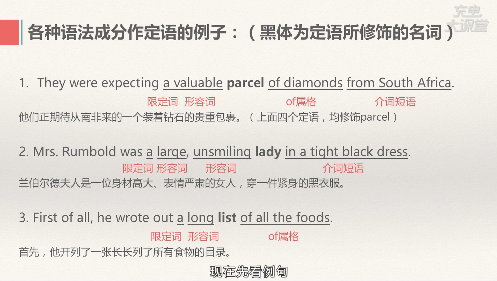

### 英语的句子成分和汉语句子成分的区别

英语的句子成分和汉语的句子成分它略微有不一样，汉语一共是八种句子成分，英语则是七种句子成分，汉语的句子对语法规则的要求并不非常严谨

### 现代英语语法，其实非常严谨

在造句方面，尤其是主从句和时态等方面，基本就是说一就是一，不会有什么特殊情况

### 首相的英语学习方法

1. 了解句子成分的具体含义识别出句子的不同成分
2. 学习时态、语法等基础知识
3. 学习从句的构句方法，怎么把一个长句子变成一个句子成分，然后把不同的句子成分组合起来
4. 用彩色笔标注不同句子成分，从句子相关成分中，积累相关用法
5. 把复杂句拆成若干个简单句子，设定好主语宾语谓语，采用学习到的规则，拼成长句子

中文的写作和造句练习一般是组词+造句，英文的联系刚好相反，首先读句子 然后拆句 最后合句

### 七大英语句子成分概述

1. 主语：句子的主人。**我**吃饭了
2. 谓语：表达主语动作状态。我**开心的吃**饭
3. 宾语：客体、受体。我**打**他
4. 表语：表达主语具体情况。我是个**人渣**
5. 补语：补充说明。我妈命令我**下班早点回家**

主谓宾应该都比较好理解，这里详细说明一下表语和补语

表语和补语是因为谓语动词有五大类，所以导致出现了不同的句子成分

表语的出现主要是因为谓语系动词它没有实际的意义，比如我**是**，我是这个句子是不完整的，这时候必须接一个句子成分叫做表语。顾名思义，表语也就是说表语主语具体情况的句子成分，就叫做表语。比如我是**人渣**，这里人渣就是表语，它表达了主语我的具体情况。

而补语则是因为另一种特殊的动词分类，不完全及物动词。完全及物动词，指的就是这个动词后面加了物体，也就是说加了名词这个句子的意思就完整了，所以叫完全及物动词。而不完全及物动词，就是说这个动词后面加了名词这个句子还是不完整。比如说我妈命令我，这里的主语是我妈，谓语是命令，宾语是我，但是这个句子是不完整的，因为我妈命令我干什么，你不知道。这个时候就必须加补语了，比如我妈命令我**下班早点回家**，这里的下班早点回家它就是补语。这种句子必须要加补语，补充说明宾语的内容，否则这个句子的意思就是不完整。

### 看下面这五句话

1. (那个)(穿着红色连衣裙的)**美女是**(我们班的)**班长**。
2. (这些)(可爱的)**孩子们**<一直>**生活**<在美丽的大山里>。
3. <放学以后>，(这几个)(高中)**学生**<到游戏厅里边>**打游戏**。
4. (我们每个人的)**努力让**(我们伟大的)**祖国**<迅速>**发展**。
5. **我**<每天晚上><睡觉前><都要>**讲给孩子**(一些)(有意义的)**童话**。

句子的主干部分主要有 主语 谓语 宾语 表语 补语，这个五个是句子的主干，只用这个五个成分，就可以写出完整的句子。

看一下这五句话，黑体字的部分是句子的主干，如果只有这些成分句子的意思表达得也很清楚，但是会很枯燥没有什么美感也缺乏细节。例如：

1. 美女是班长
2. 孩子们生活
3. 学生们打游戏
4. 努力让祖国迅速发展
5. 我讲给孩子们一些童话

意思是表达完整了，但是没有细节，你不知道他具体是怎么来做的，所以这个时候必须要加上括号里面的东西，才能显得句子有血有肉，有声有色。

小括号(...)里面的内容是定语，作用是用来修饰名词

而中括号<...>里边的内容是状语，表示动作发生的时间、地点、原因、状态、目的、结果、方式、程度等等

### 定语

定语：一个句子里用来界定、限定名词的部分

定语定语，有一个定字，顾名思义，那就是有限定，界定的意思。也就是说，定语是一个句子里用来去界定、限定的部分。这个去界定、限定的东西必须是名词，因为只有名词，你才能去限定它的意思。

    一个(高个子的，留着长发的，穿着红色衣服的，喜欢学习英语的)学生

这个句子中，(...)里面的内容就是用来界定名词 学生

### 什么语法成分能够作定语

形容词以及相当于形容词性质的语法成分可以作为定语

一般来说，一个短语，如果是"...的"，它就是形容词性质的，比如说穿着红色衣服的，喜欢学习英语的，都属于形容词短语或者形容词从句

英语的定语，有些放在名词之前，有些放在名词之后。和汉语有很大不同，汉语的定语统统放在名词之前。

### 英语95%的定语遵循“前小后大”法则，即定语的摆放顺序

1个单词组成的定语(限定词，形容词，名词及名词所有格)，放在所修饰名词的前面。

2个以上单词组成的定语(of属格，形容词短语，介词短语，分词短语，不定式短语)，放在所修饰词后面。

